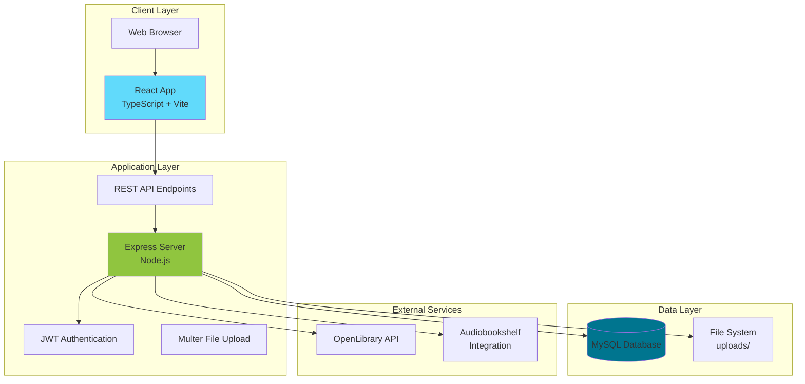
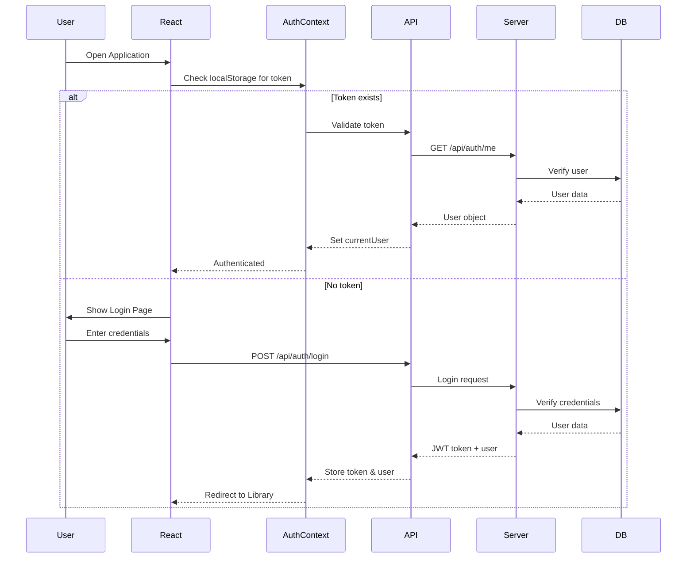
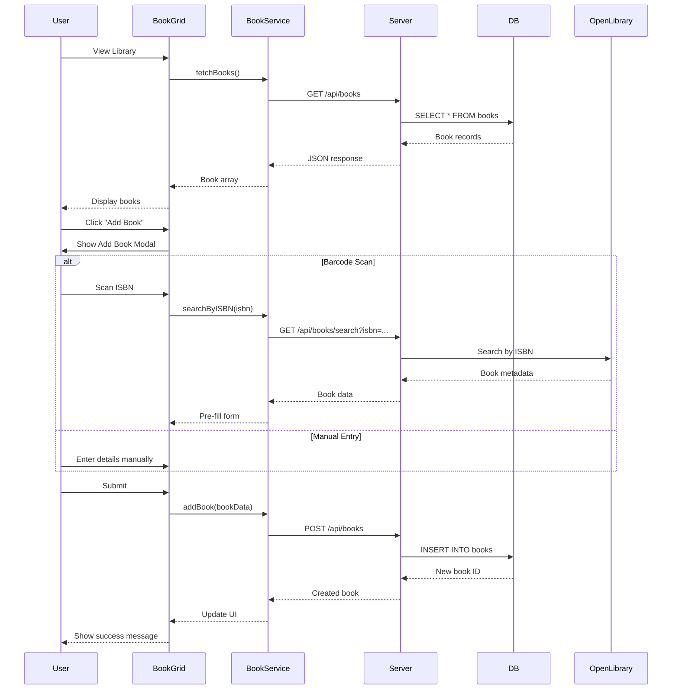
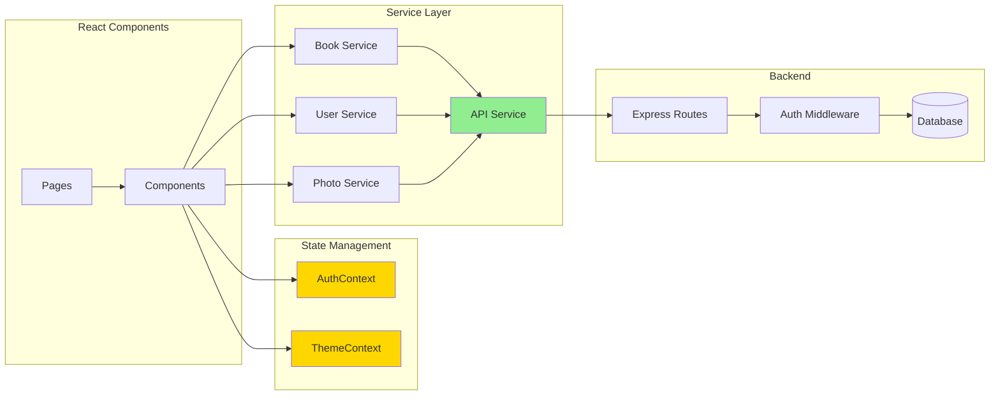
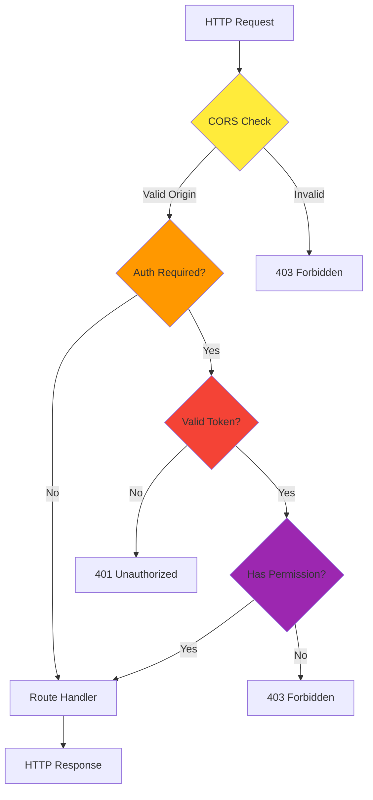
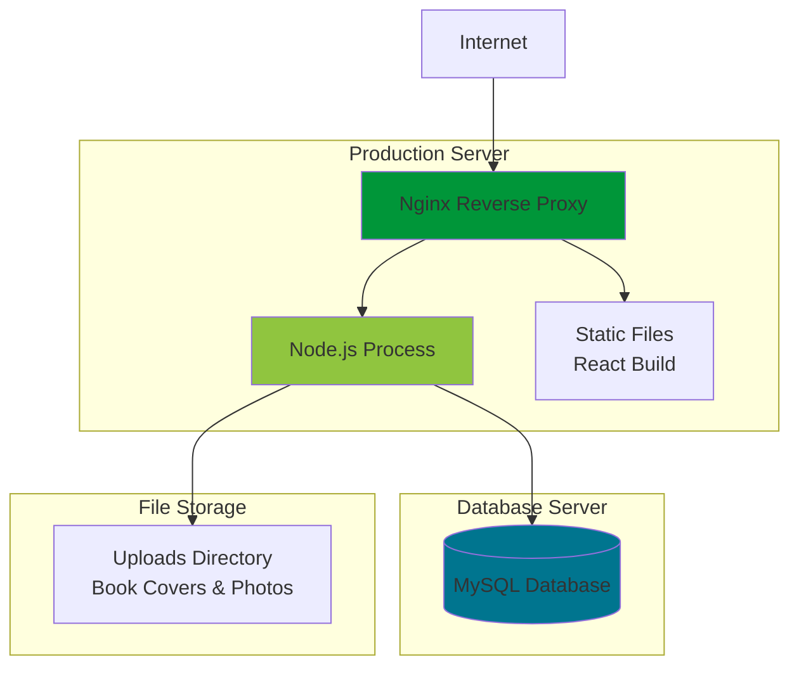

# Architecture Overview

## System Architecture

BookBoss follows a modern three-tier architecture with a React frontend, Node.js/Express backend, and MySQL database.



## Technology Stack

### Frontend
- **Framework**: React 18
- **Language**: TypeScript
- **Build Tool**: Vite (fast HMR and optimized builds)
- **Styling**: Custom CSS with CSS variables
- **Routing**: React Router v6
- **State Management**: React Context API
- **HTTP Client**: Axios
- **Icons**: Lucide React
- **Barcode Scanner**: Html5-QRCode
- **EPUB Reader**: ePub.js

### Backend
- **Runtime**: Node.js
- **Framework**: Express.js
- **Authentication**: JWT (jsonwebtoken)
- **File Uploads**: Multer
- **Database Driver**: mysql2
- **Password Hashing**: bcrypt
- **CORS**: cors middleware

### Database
- **RDBMS**: MySQL 8.0+
- **Schema Management**: SQL migration scripts
- **Indexing**: Full-text search indexes on title/author

### Development Tools
- **Package Manager**: npm
- **Version Control**: Git
- **Code Editor**: VS Code (recommended)
- **Linting**: ESLint
- **Type Checking**: TypeScript compiler

## Project Structure

```
BookBoss/
├── book-boss-react/          # React frontend application
│   ├── src/
│   │   ├── components/       # Reusable UI components
│   │   ├── context/          # React Context providers
│   │   ├── pages/            # Page-level components
│   │   ├── services/         # API service layer
│   │   ├── types/            # TypeScript type definitions
│   │   ├── utils/            # Helper functions
│   │   ├── App.tsx           # Main app component
│   │   └── main.tsx          # Entry point
│   ├── public/               # Static assets
│   └── Design/               # Design documentation
│
├── server/                   # Node.js backend
│   ├── server.js             # Main server file (all routes)
│   ├── schema.sql            # Base database schema
│   ├── update_schema_*.js    # Migration scripts
│   ├── abs-client.js         # Audiobookshelf client
│   └── uploads/              # User-uploaded files
│
├── legacy-web/               # Original vanilla JS app (deprecated)
├── migrations/               # Database migration history
└── Design/                   # Project documentation
    └── Wiki/                 # This wiki
```

## Application Flow

### User Authentication Flow



### Book Management Flow



## Data Flow Architecture



## Security Architecture

### Authentication & Authorization

1. **JWT Tokens**: Stateless authentication using JSON Web Tokens
2. **Password Hashing**: bcrypt with salt rounds for secure password storage
3. **Role-Based Access**: Admin, editor, and viewer roles
4. **Protected Routes**: Server-side middleware validates tokens on every request
5. **CORS Configuration**: Controlled cross-origin resource sharing

### Security Measures



## Performance Optimizations

### Frontend
- **Code Splitting**: Lazy loading of routes and heavy components
- **Image Optimization**: Lazy loading book covers with loading states
- **Debounced Search**: Reduced API calls during user input
- **Memoization**: React.memo for expensive components
- **Virtual Scrolling**: Efficient rendering of large book lists (planned)

### Backend
- **Database Indexing**: Indexes on frequently queried columns (ISBN, title, author)
- **Connection Pooling**: Reused database connections
- **Caching**: In-memory caching for frequently accessed data (planned)
- **Pagination**: Limit query results for large datasets

### Database
- **Full-Text Indexes**: Fast search across title and author fields
- **Foreign Key Constraints**: Maintain referential integrity
- **Optimized Queries**: Selective column fetching, JOIN optimization

## Deployment Architecture



## Scalability Considerations

### Current Scale
- Designed for personal/small group use (1-50 users)
- Handles libraries up to 10,000+ books efficiently
- Single-server deployment

### Future Scaling Options
- **Horizontal Scaling**: Load balancer + multiple Node.js instances
- **Database Replication**: Read replicas for heavy read workloads
- **CDN Integration**: Serve static assets and book covers from CDN
- **Caching Layer**: Redis for session management and frequently accessed data
- **Microservices**: Split features into separate services (e.g., search, metadata)

## API Design Principles

1. **RESTful**: Standard HTTP methods (GET, POST, PUT, DELETE)
2. **Consistent Responses**: Uniform JSON structure across endpoints
3. **Error Handling**: Descriptive error messages with appropriate status codes
4. **Versioning**: API version in URL path (currently implicit v1)
5. **Authentication**: Bearer token in Authorization header
6. **Pagination**: Offset/limit for list endpoints (planned)
7. **Filtering**: Query parameters for filtering and sorting

## Development Workflow


## Browser Compatibility

- **Modern Browsers**: Chrome 90+, Firefox 88+, Safari 14+, Edge 90+
- **Mobile Browsers**: iOS Safari 14+, Chrome Mobile 90+
- **Features Used**: ES6+, CSS Grid, CSS Custom Properties, Fetch API
- **Polyfills**: Not required for target browsers

## Accessibility

- **Semantic HTML**: Proper heading hierarchy, landmarks
- **ARIA Labels**: Screen reader support for interactive elements
- **Keyboard Navigation**: Full keyboard accessibility
- **Color Contrast**: WCAG AA compliant color schemes
- **Focus Management**: Visible focus indicators
