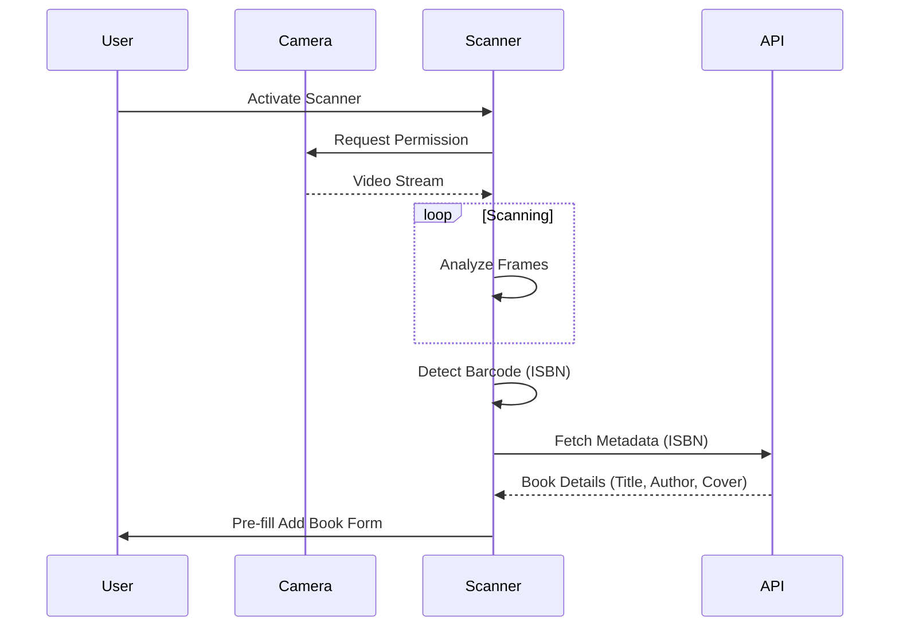

# Barcode Scanner

## Overview

The Barcode Scanner feature streamlines the process of adding physical books to the library. By using the device's camera to scan ISBN barcodes, users can instantly retrieve book metadata without manual typing.

## Technology Stack

- **Library**: `html5-qrcode`
- **API**: OpenLibrary API (for metadata lookup)

## Workflow

## Features

- **Real-time Detection**: Scans video feed for EAN-13 (ISBN-13) and EAN-8 barcodes.
- **Camera Selection**: Supports switching between front and back cameras on mobile devices.
- **Flashlight Support**: Toggle device flashlight for low-light scanning (device dependent).
- **Validation**: Automatically validates scanned codes to ensure they are valid ISBNs.

## Usage

1. Open the **Add Book** modal.
2. Switch to the **Scan** tab.
3. Grant camera permissions if prompted.
4. Point the camera at the book's barcode.
5. Upon successful scan, the form is automatically populated with the book's details.

## Troubleshooting

- **Camera Permission**: Ensure the browser has permission to access the camera.
- **Lighting**: Good lighting is essential for quick detection.
- **Focus**: Hold the camera steady and allow it to focus on the barcode.
- **HTTPS**: Modern browsers require a secure context (HTTPS) to access the camera API (except for localhost).

## Future Enhancements
- [ ] Batch scanning mode (scan multiple books in a row).
- [ ] Support for other barcode types (UPC).
- [ ] Audio feedback (beep) on successful scan.
