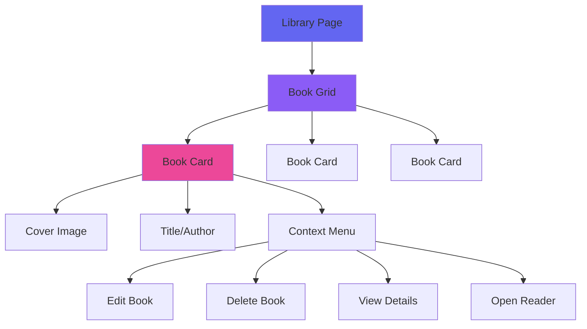
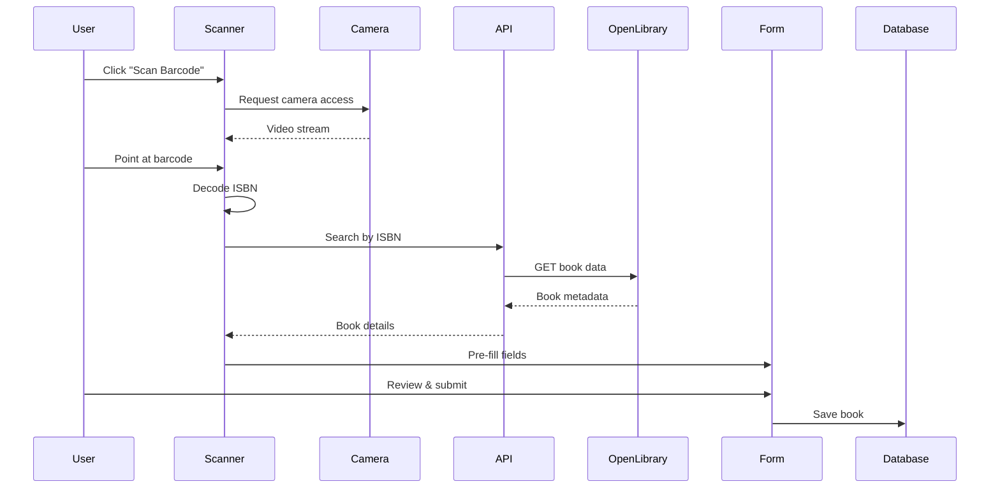
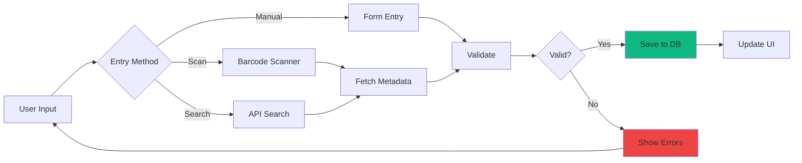
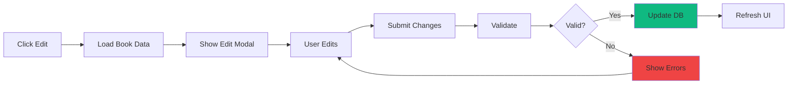

# Book Management

## Overview

The Book Management system is the core feature of BookBoss, providing comprehensive tools for organizing, tracking, and managing your personal library. It supports physical books, ebooks, and audiobooks with rich metadata and customization options.

## Features

### Book Library Grid

The main library view displays all books in a responsive grid layout with:
- **Book covers**: High-quality cover images from OpenLibrary or custom uploads
- **Title and author**: Prominently displayed
- **Quick actions**: Context menu for edit, delete, view details
- **Visual indicators**: Icons for format type, reading status, loans
- **Responsive design**: Adapts from 2 to 5 columns based on screen size



### Adding Books

Multiple methods for adding books to your library:

#### 1. Barcode Scanner
- **Camera-based scanning**: Uses device camera to scan ISBN barcodes
- **Instant lookup**: Automatically fetches book data from OpenLibrary
- **Auto-populate**: Pre-fills all book details
- **Manual override**: Edit any field before saving

**Flow:**


#### 2. Online Search
- **Search by ISBN**: Most accurate results
- **Search by title**: Find books by name
- **Search by author**: Browse author's works
- **One-click add**: Add directly from search results

#### 3. Manual Entry
- **Full control**: Enter all details manually
- **Required fields**: Only title is required
- **Optional metadata**: Add as much or as little as you want
- **Custom covers**: Upload your own cover images

### Book Details

Each book can store extensive metadata:

#### Basic Information
- **Title**: Book title (required)
- **Author**: Author name(s)
- **ISBN**: ISBN-10 or ISBN-13
- **Publisher**: Publishing company
- **Publication Year**: Year published
- **Page Count**: Total pages
- **Language**: Language code (en, es, fr, etc.)
- **Description**: Synopsis or summary

#### Physical Details (for physical books)
- **Format**: Physical, Ebook, or Audiobook
- **Binding Type**: Hardback, Paperback, Mass Market, Board Book, Leather Bound
- **Condition**: Excellent, Good, Fair, Poor
- **Special Features**:
  - Signed Copy
  - First Edition
  - Limited Edition
  - Bonus Chapters
  - Gilded Edges
  - Fore-edge Painting
  - Sprayed Edges
  - Hidden Fore-edge Art

#### Reading Information
- **Status**: Not Started, In Progress, Completed, DNF (Did Not Finish)
- **Current Page**: Track reading progress
- **Rating**: 0-5 stars (supports decimals)
- **Review**: Personal notes and review

#### Digital Information (for ebooks)
- **File Path**: Location of EPUB/PDF file
- **Downloaded**: Track if downloaded from external source

### Book Covers

Multiple options for book cover images:

1. **OpenLibrary API**: Automatically fetched during search
2. **Custom Upload**: Upload your own cover image
3. **Photo Gallery**: Multiple photos per book (see Photo Gallery feature)
4. **Fallback**: Default placeholder if no cover available

**Supported formats**: JPG, PNG, WebP

### Editing Books

- **Quick edit**: Click context menu → Edit
- **Full modal**: Edit all fields in a comprehensive form
- **Cover replacement**: Upload new cover image
- **Metadata refresh**: Re-fetch data from OpenLibrary
- **Validation**: Ensures data integrity before saving

### Deleting Books

- **Confirmation dialog**: Prevents accidental deletion
- **Cascade delete**: Removes all associated data (photos, loans, list entries)
- **Permanent**: Cannot be undone (consider export before deletion)

### Search & Filter

#### Search
- **Real-time search**: Results update as you type
- **Multi-field**: Searches title, author, and ISBN
- **Full-text**: Uses MySQL FULLTEXT index for fast results
- **Relevance ranking**: Best matches appear first

#### Filters
- **Format**: Physical, Ebook, Audiobook
- **Status**: Not Started, In Progress, Completed, DNF
- **Downloaded**: Show only downloaded books
- **Loaned**: Show only loaned books
- **Custom shelves**: Filter by shelf membership
- **Reading lists**: Filter by list membership

#### Sorting
- **Title**: Alphabetical by title
- **Author**: Alphabetical by author
- **Date Added**: Newest or oldest first
- **Rating**: Highest or lowest rated
- **Page Count**: Longest or shortest
- **Publication Year**: Newest or oldest publication

### Bulk Operations

Planned features for managing multiple books:
- **Bulk select**: Checkbox selection mode
- **Bulk delete**: Remove multiple books at once
- **Bulk edit**: Update common fields across books
- **Bulk tag**: Add to shelves or lists
- **Bulk export**: Export selected books

### Book Statistics

View comprehensive statistics about your library:
- **Total books**: Overall count
- **By format**: Physical, ebook, audiobook breakdown
- **By status**: Reading progress distribution
- **Total pages**: Sum of all page counts
- **Average rating**: Mean rating across all books
- **Top authors**: Most frequent authors in library
- **Reading pace**: Pages per day, books per month

### Import/Export

#### Export Options
- **CSV**: Spreadsheet-compatible format
- **JSON**: Complete data export with all metadata
- **Calibre**: Compatible with Calibre library format (planned)

#### Import Options
- **CSV**: Import from spreadsheet
- **Goodreads**: Import from Goodreads export (planned)
- **Calibre**: Import from Calibre library (planned)

## User Interface

### Book Card Component

Each book is displayed as a card with:

```
┌─────────────────────┐
│                     │
│   [Cover Image]     │
│                     │
├─────────────────────┤
│ Title               │
│ Author              │
├─────────────────────┤
│ ⭐⭐⭐⭐⭐ 4.5      │
│ 📖 In Progress      │
│ 📄 250/400 pages    │
└─────────────────────┘
```

### Context Menu

Right-click or click menu icon:
```
┌─────────────────┐
│ ✏️  Edit Book    │
│ 📖 Open Reader  │
│ 📸 View Photos  │
│ 🔗 Loan Book    │
│ 🗑️  Delete      │
└─────────────────┘
```

### Add Book Modal

Tabbed interface:
```
┌────────────────────────────────┐
│ [Manual] [Search] [Scan]       │
├────────────────────────────────┤
│                                │
│  Title: ___________________    │
│  Author: __________________    │
│  ISBN: ____________________    │
│  ...                           │
│                                │
│  [Cancel]  [Add Book]          │
└────────────────────────────────┘
```

## Data Flow

### Adding a Book



### Editing a Book



## Best Practices

### Organizing Your Library

1. **Use consistent naming**: Keep author names formatted consistently
2. **Add ISBNs**: Enables better metadata fetching and duplicate detection
3. **Rate and review**: Add personal ratings to track favorites
4. **Use shelves**: Organize books into custom categories
5. **Track reading**: Update status and current page regularly
6. **Add photos**: Capture special features of physical books

### Data Quality

1. **Verify metadata**: Check auto-fetched data for accuracy
2. **Add descriptions**: Helps remember why you added a book
3. **Update covers**: Replace low-quality covers with better images
4. **Use special features**: Tag first editions, signed copies, etc.
5. **Regular backups**: Export your library periodically

### Performance Tips

1. **Lazy loading**: Covers load as you scroll
2. **Search efficiently**: Use specific terms for faster results
3. **Filter before search**: Narrow down results with filters first
4. **Limit photos**: Keep photo sizes reasonable (< 5MB each)

## Keyboard Shortcuts

- `Ctrl/Cmd + K`: Focus search bar
- `Ctrl/Cmd + N`: Add new book (planned)
- `Escape`: Close modals
- `Enter`: Submit forms

## Mobile Considerations

- **Touch-friendly**: 44px minimum touch targets
- **Swipe gestures**: Swipe to reveal actions (planned)
- **Responsive grid**: Adapts to screen size
- **Mobile menu**: Hamburger menu for navigation
- **Camera access**: Native camera for barcode scanning

## Troubleshooting

### Cover images not loading
- Check internet connection for OpenLibrary images
- Verify file path for custom uploads
- Clear browser cache

### Search not working
- Ensure search term is at least 2 characters
- Check database connection
- Verify FULLTEXT index exists

### Barcode scanner not working
- Grant camera permissions
- Ensure good lighting
- Try manual ISBN entry
- Check browser compatibility (HTTPS required)

## Future Enhancements

- [ ] Virtual scrolling for large libraries (10,000+ books)
- [ ] Advanced search builder UI
- [ ] Bulk operations (select multiple books)
- [ ] Duplicate detection and merging
- [ ] Series grouping and sorting
- [ ] Custom fields and metadata
- [ ] Book recommendations based on library
- [ ] Reading goals and challenges
