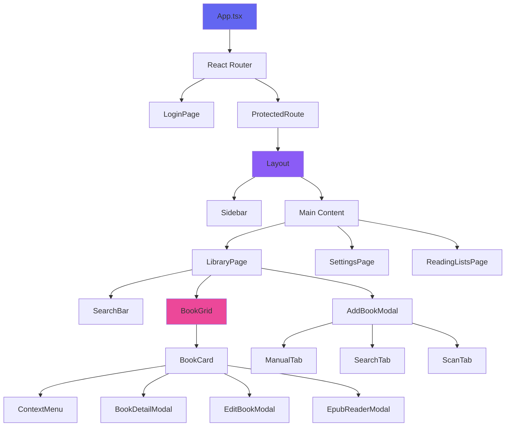

# Component Library

## Overview

BookBoss uses a component-based architecture with reusable React components. This document catalogs all components and their usage.

## Component Hierarchy



## Core Components

### App.tsx

**Purpose:** Root application component with routing

**Features:**
- React Router setup
- Protected route wrapper
- Global context providers

**Usage:**
```tsx
<AuthProvider>
  <ThemeProvider>
    <BrowserRouter>
      <Routes>
        <Route path="/login" element={<LoginPage />} />
        <Route path="/" element={<ProtectedRoute><LibraryPage /></ProtectedRoute>} />
      </Routes>
    </BrowserRouter>
  </ThemeProvider>
</AuthProvider>
```

---

### Layout

**Purpose:** Main application layout with sidebar and content area

**Props:**
```typescript
interface LayoutProps {
  children: React.ReactNode;
}
```

**Features:**
- Responsive sidebar
- Mobile hamburger menu
- Main content area
- Consistent spacing

**File:** `components/Layout.tsx`

---

## Page Components

### LibraryPage

**Purpose:** Main library view with book grid

**Features:**
- Book grid display
- Search functionality
- Filter controls
- Add book button
- Statistics display

**State:**
- `books`: Array of books
- `searchTerm`: Current search query
- `filters`: Active filters
- `loading`: Loading state

**File:** `pages/LibraryPage.tsx`

---

### SettingsPage

**Purpose:** User settings and configuration

**Features:**
- Tabbed interface
- General settings
- Profile management
- User administration (admin only)
- Export options
- Audiobookshelf integration

**Tabs:**
1. General
2. Profile
3. Filters
4. Export
5. Users (admin)
6. Audiobookshelf

**File:** `pages/SettingsPage.tsx`

---

### LoginPage

**Purpose:** User authentication

**Features:**
- Login form
- Registration form
- Form validation
- Error handling
- Auto-redirect on success

**File:** `pages/LoginPage.tsx`

---

### ReadingListsPage

**Purpose:** Manage custom reading lists

**Features:**
- List creation
- List editing
- Add/remove books
- Public/private toggle
- List deletion

**File:** `pages/ReadingListsPage.tsx`

---

## Book Components

### BookCard

**Purpose:** Display individual book in grid

**Props:**
```typescript
interface BookCardProps {
  book: Book;
  onEdit: (book: Book) => void;
  onDelete: (id: number) => void;
  onView: (book: Book) => void;
}
```

**Features:**
- Cover image with lazy loading
- Title and author display
- Rating stars
- Status indicator
- Context menu
- Hover effects

**File:** `components/BookCard.tsx`

---

### BookGrid

**Purpose:** Responsive grid layout for books

**Props:**
```typescript
interface BookGridProps {
  books: Book[];
  loading?: boolean;
}
```

**Features:**
- Responsive columns (2-5)
- Loading skeletons
- Empty state
- Infinite scroll (planned)

**File:** `components/BookGrid.tsx`

---

### BookDetailModal

**Purpose:** View detailed book information

**Props:**
```typescript
interface BookDetailModalProps {
  book: Book;
  isOpen: boolean;
  onClose: () => void;
  onEdit: () => void;
}
```

**Features:**
- Full metadata display
- Photo gallery
- Loan information
- Reading progress
- Action buttons

**File:** `components/BookDetailModal.tsx`

---

### AddBookModal

**Purpose:** Add new books to library

**Props:**
```typescript
interface AddBookModalProps {
  isOpen: boolean;
  onClose: () => void;
  onAdd: (book: Partial<Book>) => void;
}
```

**Tabs:**
1. **Manual**: Manual entry form
2. **Search**: OpenLibrary API search
3. **Scan**: Barcode scanner

**File:** `components/AddBookModal.tsx`

---

### EditBookModal

**Purpose:** Edit existing book details

**Props:**
```typescript
interface EditBookModalProps {
  book: Book;
  isOpen: boolean;
  onClose: () => void;
  onSave: (book: Book) => void;
}
```

**Features:**
- Pre-filled form
- Cover upload
- Metadata editing
- Validation
- Save/cancel actions

**File:** `components/EditBookModal.tsx`

---

## Navigation Components

### Sidebar

**Purpose:** Main navigation menu

**Features:**
- Navigation links
- Active state highlighting
- User info display
- Logout button
- Mobile collapse

**Links:**
- Library
- Reading Lists
- Statistics
- Settings

**File:** `components/Sidebar.tsx`

---

### SearchBar

**Purpose:** Search books in library

**Props:**
```typescript
interface SearchBarProps {
  value: string;
  onChange: (value: string) => void;
  placeholder?: string;
}
```

**Features:**
- Debounced input (300ms)
- Clear button
- Search icon
- Keyboard shortcuts

**File:** `components/SearchBar.tsx`

---

## Modal Components

### Modal (Base)

**Purpose:** Reusable modal wrapper

**Props:**
```typescript
interface ModalProps {
  isOpen: boolean;
  onClose: () => void;
  title?: string;
  children: React.ReactNode;
  size?: 'small' | 'medium' | 'large';
}
```

**Features:**
- Backdrop click to close
- Escape key to close
- Focus trap
- Scroll lock
- Animations

**File:** `components/Modal.tsx`

---

### ConfirmDialog

**Purpose:** Confirmation prompts

**Props:**
```typescript
interface ConfirmDialogProps {
  isOpen: boolean;
  title: string;
  message: string;
  onConfirm: () => void;
  onCancel: () => void;
  confirmText?: string;
  cancelText?: string;
}
```

**File:** `components/ConfirmDialog.tsx`

---

### EpubReaderModal

**Purpose:** Read EPUB files in browser

**Props:**
```typescript
interface EpubReaderModalProps {
  book: Book;
  isOpen: boolean;
  onClose: () => void;
}
```

**Features:**
- ePub.js integration
- Page navigation
- Progress tracking
- Bookmark support (planned)
- Text customization (planned)

**File:** `components/EpubReaderModal.tsx`

---

## Form Components

### Input

**Purpose:** Reusable text input

**Props:**
```typescript
interface InputProps {
  label?: string;
  value: string;
  onChange: (value: string) => void;
  type?: 'text' | 'email' | 'password' | 'number';
  placeholder?: string;
  error?: string;
  required?: boolean;
}
```

**File:** `components/Input.tsx`

---

### Select

**Purpose:** Dropdown select input

**Props:**
```typescript
interface SelectProps {
  label?: string;
  value: string;
  onChange: (value: string) => void;
  options: Array<{ value: string; label: string }>;
  error?: string;
}
```

**File:** `components/Select.tsx`

---

### Button

**Purpose:** Reusable button component

**Props:**
```typescript
interface ButtonProps {
  children: React.ReactNode;
  onClick?: () => void;
  variant?: 'primary' | 'secondary' | 'danger';
  size?: 'small' | 'medium' | 'large';
  disabled?: boolean;
  type?: 'button' | 'submit';
}
```

**Variants:**
- **Primary**: Main actions (blue)
- **Secondary**: Secondary actions (gray)
- **Danger**: Destructive actions (red)

**File:** `components/Button.tsx`

---

### StarRating

**Purpose:** Display and edit star ratings

**Props:**
```typescript
interface StarRatingProps {
  rating: number;
  onChange?: (rating: number) => void;
  readonly?: boolean;
  size?: 'small' | 'medium' | 'large';
}
```

**Features:**
- Half-star support
- Hover preview
- Click to rate
- Readonly mode

**File:** `components/StarRating.tsx`

---

## Feature Components

### PhotoGallery

**Purpose:** Display and manage book photos

**Props:**
```typescript
interface PhotoGalleryProps {
  bookId: number;
  photos: BookPhoto[];
  onUpload: (file: File, tag: string) => void;
  onDelete: (photoId: number) => void;
}
```

**Features:**
- Photo upload
- Tag filtering
- Lightbox view
- Delete photos
- Reorder photos (planned)

**File:** `components/PhotoGallery.tsx`

---

### LoanModal

**Purpose:** Track book loans

**Props:**
```typescript
interface LoanModalProps {
  book: Book;
  isOpen: boolean;
  onClose: () => void;
  onLoan: (loan: Partial<Loan>) => void;
}
```

**Features:**
- Borrower name input
- Date pickers
- Notes field
- Active loan display
- Return book action

**File:** `components/LoanModal.tsx`

---

### Toast

**Purpose:** Notification messages

**Props:**
```typescript
interface ToastProps {
  message: string;
  type: 'success' | 'error' | 'info' | 'warning';
  duration?: number;
  onClose: () => void;
}
```

**Features:**
- Auto-dismiss
- Manual close
- Icon based on type
- Slide-in animation

**File:** `components/Toast.tsx`

---

## Utility Components

### LoadingSpinner

**Purpose:** Loading indicator

**Props:**
```typescript
interface LoadingSpinnerProps {
  size?: 'small' | 'medium' | 'large';
  color?: string;
}
```

**File:** `components/LoadingSpinner.tsx`

---

### EmptyState

**Purpose:** Display when no data

**Props:**
```typescript
interface EmptyStateProps {
  icon?: React.ReactNode;
  title: string;
  message: string;
  action?: {
    label: string;
    onClick: () => void;
  };
}
```

**File:** `components/EmptyState.tsx`

---

### ContextMenu

**Purpose:** Right-click menu for books

**Props:**
```typescript
interface ContextMenuProps {
  items: Array<{
    label: string;
    icon?: React.ReactNode;
    onClick: () => void;
    danger?: boolean;
  }>;
  position: { x: number; y: number };
  onClose: () => void;
}
```

**File:** `components/ContextMenu.tsx`

---

## Tab Components

### ManualTab

**Purpose:** Manual book entry form

**Features:**
- All book fields
- Cover upload
- Validation
- Submit handler

**File:** `components/AddBookModal/ManualTab.tsx`

---

### SearchTab

**Purpose:** OpenLibrary API search

**Features:**
- Search input
- Results display
- One-click add
- Loading states

**File:** `components/AddBookModal/SearchTab.tsx`

---

### ScanTab

**Purpose:** Barcode scanner

**Features:**
- Camera access
- Barcode detection
- ISBN lookup
- Auto-populate form

**File:** `components/AddBookModal/ScanTab.tsx`

---

## Settings Tab Components

### GeneralTab

**Purpose:** General app settings

**Features:**
- Theme toggle
- Accent color picker
- Default view
- Books per page

**File:** `components/SettingsPage/GeneralTab.tsx`

---

### UsersTab

**Purpose:** User management (admin only)

**Features:**
- User list
- Create user
- Edit user
- Delete user
- Role assignment

**File:** `components/SettingsPage/UsersTab.tsx`

---

## Styling Patterns

### CSS Modules

Each component has a corresponding CSS file:
```
BookCard.tsx
BookCard.css
```

### BEM Naming

```css
.book-card { }
.book-card__cover { }
.book-card__title { }
.book-card--loading { }
```

### Responsive Design

```css
/* Mobile first */
.book-grid {
  grid-template-columns: repeat(2, 1fr);
}

@media (min-width: 768px) {
  .book-grid {
    grid-template-columns: repeat(3, 1fr);
  }
}
```

## Best Practices

1. **Props Interface**: Always define TypeScript interface for props
2. **Default Props**: Use default parameters for optional props
3. **Error Boundaries**: Wrap components that might error
4. **Loading States**: Show loading indicators for async operations
5. **Accessibility**: Add ARIA labels and keyboard support
6. **Memoization**: Use React.memo for expensive components
7. **Cleanup**: Clean up effects and event listeners

## Future Components

- [ ] VirtualScroll (for large lists)
- [ ] DragAndDrop (for reordering)
- [ ] Chart (for statistics)
- [ ] Calendar (for reading schedule)
- [ ] Timeline (for reading history)
- [ ] Carousel (for featured books)
- [ ] Tabs (generic tabbed interface)
- [ ] Accordion (collapsible sections)
