# Database Schema

## Entity Relationship Diagram

```mermaid
erDiagram
    users ||--o{ books : owns
    users ||--o{ reading_lists : creates
    users ||--o{ reading_sessions : tracks
    users ||--o{ user_shelves : creates
    
    books ||--o{ book_photos : has
    books ||--o{ loans : "lent as"
    books ||--o{ reading_list_books : "appears in"
    books ||--o{ shelf_books : "placed on"
    
    reading_lists ||--o{ reading_list_books : contains
    user_shelves ||--o{ shelf_books : contains
    
    users {
        int id PK
        string username UK
        string password_hash
        string email
        string role
        json permissions
        datetime created_at
        datetime updated_at
    }
    
    books {
        int id PK
        int user_id FK
        string title
        string author
        string isbn
        string publisher
        string language
        int publication_year
        int page_count
        text description
        string cover_url
        string cover_image_path
        string format
        string binding_type
        string condition
        json special_features
        decimal rating
        text review
        string status
        int current_page
        string file_path
        boolean downloaded
        datetime created_at
        datetime updated_at
    }
    
    book_photos {
        int id PK
        int book_id FK
        string file_path
        string tag
        text description
        int display_order
        datetime created_at
    }
    
    loans {
        int id PK
        int book_id FK
        int user_id FK
        string borrower_name
        date loan_date
        date due_date
        date return_date
        text notes
        datetime created_at
    }
    
    reading_lists {
        int id PK
        int user_id FK
        string name
        text description
        boolean is_public
        int book_count
        datetime created_at
        datetime updated_at
    }
    
    reading_list_books {
        int id PK
        int list_id FK
        int book_id FK
        int position
        datetime added_at
    }
    
    user_shelves {
        int id PK
        int user_id FK
        string name
        text description
        string color
        int book_count
        datetime created_at
        datetime updated_at
    }
    
    shelf_books {
        int id PK
        int shelf_id FK
        int book_id FK
        int position
        datetime added_at
    }
    
    reading_sessions {
        int id PK
        int user_id FK
        int book_id FK
        datetime start_time
        datetime end_time
        int pages_read
        int duration_minutes
    }
```



## Table Definitions

### users

Stores user account information and authentication data.

| Column | Type | Constraints | Description |
|--------|------|-------------|-------------|
| id | INT | PRIMARY KEY, AUTO_INCREMENT | Unique user identifier |
| username | VARCHAR(50) | UNIQUE, NOT NULL | Login username |
| password_hash | VARCHAR(255) | NOT NULL | bcrypt hashed password |
| email | VARCHAR(100) | | User email address |
| role | VARCHAR(20) | DEFAULT 'viewer' | User role: admin, editor, viewer |
| permissions | JSON | | Custom permissions object |
| created_at | TIMESTAMP | DEFAULT CURRENT_TIMESTAMP | Account creation time |
| updated_at | TIMESTAMP | ON UPDATE CURRENT_TIMESTAMP | Last update time |

**Indexes:**
- PRIMARY KEY on `id`
- UNIQUE INDEX on `username`

---

### books

Core table storing all book information and metadata.

| Column | Type | Constraints | Description |
|--------|------|-------------|-------------|
| id | INT | PRIMARY KEY, AUTO_INCREMENT | Unique book identifier |
| user_id | INT | FOREIGN KEY → users(id) | Owner of the book |
| title | VARCHAR(255) | NOT NULL | Book title |
| author | VARCHAR(255) | | Author name(s) |
| isbn | VARCHAR(20) | | ISBN-10 or ISBN-13 |
| publisher | VARCHAR(255) | | Publisher name |
| language | VARCHAR(50) | | Language code (e.g., 'en', 'es') |
| publication_year | INT | | Year published |
| page_count | INT | | Total number of pages |
| description | TEXT | | Book synopsis/description |
| cover_url | VARCHAR(500) | | External cover image URL |
| cover_image_path | VARCHAR(255) | | Local uploaded cover path |
| format | VARCHAR(50) | | physical, ebook, audiobook |
| binding_type | VARCHAR(50) | | Hardback, Paperback, etc. |
| condition | VARCHAR(50) | | Excellent, Good, Fair, Poor |
| special_features | JSON | | Array of special features |
| rating | DECIMAL(3,2) | | User rating (0.00 - 5.00) |
| review | TEXT | | Personal review/notes |
| status | VARCHAR(50) | | not_started, in_progress, completed, dnf |
| current_page | INT | | Current reading progress |
| file_path | VARCHAR(255) | | Path to ebook file (EPUB, PDF) |
| downloaded | BOOLEAN | DEFAULT FALSE | Downloaded from external source |
| created_at | TIMESTAMP | DEFAULT CURRENT_TIMESTAMP | Record creation time |
| updated_at | TIMESTAMP | ON UPDATE CURRENT_TIMESTAMP | Last update time |

**Indexes:**
- PRIMARY KEY on `id`
- INDEX on `user_id`
- INDEX on `isbn`
- FULLTEXT INDEX on `title, author` (for search)

---

### book_photos

Stores multiple photos for each book (covers, special pages, etc.).

| Column | Type | Constraints | Description |
|--------|------|-------------|-------------|
| id | INT | PRIMARY KEY, AUTO_INCREMENT | Unique photo identifier |
| book_id | INT | FOREIGN KEY → books(id) ON DELETE CASCADE | Associated book |
| file_path | VARCHAR(255) | NOT NULL | Path to photo file |
| tag | VARCHAR(50) | | Photo category: cover, spine, edges, interior, special |
| description | TEXT | | Photo description/notes |
| display_order | INT | DEFAULT 0 | Sort order for display |
| created_at | TIMESTAMP | DEFAULT CURRENT_TIMESTAMP | Upload time |

**Indexes:**
- PRIMARY KEY on `id`
- INDEX on `book_id`
- INDEX on `tag`

---

### loans

Tracks books lent to friends with due dates.

| Column | Type | Constraints | Description |
|--------|------|-------------|-------------|
| id | INT | PRIMARY KEY, AUTO_INCREMENT | Unique loan identifier |
| book_id | INT | FOREIGN KEY → books(id) ON DELETE CASCADE | Loaned book |
| user_id | INT | FOREIGN KEY → users(id) | User who owns the book |
| borrower_name | VARCHAR(100) | NOT NULL | Name of borrower |
| loan_date | DATE | NOT NULL | Date book was lent |
| due_date | DATE | | Expected return date |
| return_date | DATE | | Actual return date (NULL if not returned) |
| notes | TEXT | | Additional notes about the loan |
| created_at | TIMESTAMP | DEFAULT CURRENT_TIMESTAMP | Record creation time |

**Indexes:**
- PRIMARY KEY on `id`
- INDEX on `book_id`
- INDEX on `user_id`
- INDEX on `return_date` (to find active loans)

---

### reading_lists

User-created collections of books (e.g., "To Read", "Favorites").

| Column | Type | Constraints | Description |
|--------|------|-------------|-------------|
| id | INT | PRIMARY KEY, AUTO_INCREMENT | Unique list identifier |
| user_id | INT | FOREIGN KEY → users(id) ON DELETE CASCADE | List owner |
| name | VARCHAR(100) | NOT NULL | List name |
| description | TEXT | | List description |
| is_public | BOOLEAN | DEFAULT FALSE | Visible to other users |
| book_count | INT | DEFAULT 0 | Cached count of books |
| created_at | TIMESTAMP | DEFAULT CURRENT_TIMESTAMP | List creation time |
| updated_at | TIMESTAMP | ON UPDATE CURRENT_TIMESTAMP | Last update time |

**Indexes:**
- PRIMARY KEY on `id`
- INDEX on `user_id`

---

### reading_list_books

Junction table linking books to reading lists.

| Column | Type | Constraints | Description |
|--------|------|-------------|-------------|
| id | INT | PRIMARY KEY, AUTO_INCREMENT | Unique entry identifier |
| list_id | INT | FOREIGN KEY → reading_lists(id) ON DELETE CASCADE | Associated list |
| book_id | INT | FOREIGN KEY → books(id) ON DELETE CASCADE | Associated book |
| position | INT | DEFAULT 0 | Sort order within list |
| added_at | TIMESTAMP | DEFAULT CURRENT_TIMESTAMP | When book was added |

**Indexes:**
- PRIMARY KEY on `id`
- UNIQUE INDEX on `(list_id, book_id)`
- INDEX on `list_id`
- INDEX on `book_id`

---

### user_shelves

Custom virtual shelves for organizing books.

| Column | Type | Constraints | Description |
|--------|------|-------------|-------------|
| id | INT | PRIMARY KEY, AUTO_INCREMENT | Unique shelf identifier |
| user_id | INT | FOREIGN KEY → users(id) ON DELETE CASCADE | Shelf owner |
| name | VARCHAR(100) | NOT NULL | Shelf name |
| description | TEXT | | Shelf description |
| color | VARCHAR(7) | | Hex color code for UI |
| book_count | INT | DEFAULT 0 | Cached count of books |
| created_at | TIMESTAMP | DEFAULT CURRENT_TIMESTAMP | Shelf creation time |
| updated_at | TIMESTAMP | ON UPDATE CURRENT_TIMESTAMP | Last update time |

**Indexes:**
- PRIMARY KEY on `id`
- INDEX on `user_id`

---

### shelf_books

Junction table linking books to shelves.

| Column | Type | Constraints | Description |
|--------|------|-------------|-------------|
| id | INT | PRIMARY KEY, AUTO_INCREMENT | Unique entry identifier |
| shelf_id | INT | FOREIGN KEY → user_shelves(id) ON DELETE CASCADE | Associated shelf |
| book_id | INT | FOREIGN KEY → books(id) ON DELETE CASCADE | Associated book |
| position | INT | DEFAULT 0 | Sort order on shelf |
| added_at | TIMESTAMP | DEFAULT CURRENT_TIMESTAMP | When book was added |

**Indexes:**
- PRIMARY KEY on `id`
- UNIQUE INDEX on `(shelf_id, book_id)`
- INDEX on `shelf_id`
- INDEX on `book_id`

---

### reading_sessions

Tracks individual reading sessions for analytics.

| Column | Type | Constraints | Description |
|--------|------|-------------|-------------|
| id | INT | PRIMARY KEY, AUTO_INCREMENT | Unique session identifier |
| user_id | INT | FOREIGN KEY → users(id) ON DELETE CASCADE | User who read |
| book_id | INT | FOREIGN KEY → books(id) ON DELETE CASCADE | Book being read |
| start_time | TIMESTAMP | NOT NULL | Session start time |
| end_time | TIMESTAMP | | Session end time |
| pages_read | INT | | Number of pages read |
| duration_minutes | INT | | Calculated session duration |

**Indexes:**
- PRIMARY KEY on `id`
- INDEX on `user_id`
- INDEX on `book_id`
- INDEX on `start_time`

---

## Relationships

### One-to-Many Relationships

1. **users → books**: One user owns many books
2. **users → reading_lists**: One user creates many reading lists
3. **users → user_shelves**: One user creates many shelves
4. **users → reading_sessions**: One user has many reading sessions
5. **books → book_photos**: One book has many photos
6. **books → loans**: One book can be loaned multiple times (history)
7. **reading_lists → reading_list_books**: One list contains many books
8. **user_shelves → shelf_books**: One shelf contains many books

### Many-to-Many Relationships

1. **books ↔ reading_lists** (via `reading_list_books`)
2. **books ↔ user_shelves** (via `shelf_books`)

## Data Integrity

### Foreign Key Constraints

All foreign keys use `ON DELETE CASCADE` to maintain referential integrity:
- Deleting a user removes all their books, lists, shelves, and sessions
- Deleting a book removes all its photos, loans, and list/shelf associations
- Deleting a list/shelf removes all book associations

### Unique Constraints

- `users.username`: Prevents duplicate usernames
- `(list_id, book_id)` in `reading_list_books`: Prevents duplicate entries
- `(shelf_id, book_id)` in `shelf_books`: Prevents duplicate entries

## Indexes for Performance

### Search Optimization
- **FULLTEXT** index on `books(title, author)` enables fast full-text search
- Regular indexes on `isbn`, `user_id` for quick lookups

### Join Optimization
- Foreign key columns are indexed for efficient JOIN operations
- Junction tables have indexes on both foreign keys

### Filter Optimization
- `loans.return_date` indexed for finding active loans
- `reading_sessions.start_time` indexed for date-range queries

## JSON Fields

### books.special_features
Stores array of special feature strings:
```json
["Signed Copy", "First Edition", "Bonus Chapters"]
```

### users.permissions
Stores custom permission object:
```json
{
  "canEditAllBooks": true,
  "canManageUsers": true,
  "canAccessAdmin": true
}
```

## Migration History

The database schema has evolved through several migrations:

1. **schema.sql**: Base schema with users and books
2. **update_schema.js**: Added photo gallery and metadata fields
3. **update_schema_sorting.js**: Added sorting and filtering fields
4. **update_schema_loans.js**: Added loan tracking
5. **update_schema_calibre_features.js**: Added reading lists, shelves, sessions
6. **update_schema_abs.js**: Added Audiobookshelf integration fields

## Sample Queries

### Get all books with their photos
```sql
SELECT b.*, 
       JSON_ARRAYAGG(
         JSON_OBJECT(
           'id', p.id,
           'file_path', p.file_path,
           'tag', p.tag
         )
       ) as photos
FROM books b
LEFT JOIN book_photos p ON b.id = p.book_id
WHERE b.user_id = ?
GROUP BY b.id;
```

### Find active loans
```sql
SELECT l.*, b.title, b.author
FROM loans l
JOIN books b ON l.book_id = b.id
WHERE l.user_id = ? AND l.return_date IS NULL
ORDER BY l.due_date ASC;
```

### Get reading statistics
```sql
SELECT 
  COUNT(*) as total_books,
  SUM(CASE WHEN status = 'completed' THEN 1 ELSE 0 END) as completed,
  SUM(CASE WHEN status = 'in_progress' THEN 1 ELSE 0 END) as in_progress,
  AVG(rating) as avg_rating,
  SUM(page_count) as total_pages
FROM books
WHERE user_id = ?;
```

### Search books by title or author
```sql
SELECT * FROM books
WHERE user_id = ?
  AND MATCH(title, author) AGAINST(? IN NATURAL LANGUAGE MODE)
ORDER BY MATCH(title, author) AGAINST(? IN NATURAL LANGUAGE MODE) DESC;
```
