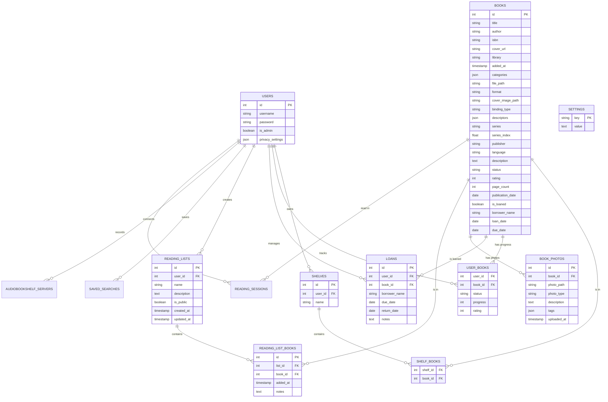

# Database Design

This document details the database schema for the BookBoss application.

## Entity Relationship Diagram (ERD)

## Table Definitions

### Core Tables

-   **`users`**: Stores user credentials and admin status.
-   **`books`**: The central table storing all book metadata (Title, Author, ISBN, etc.) and file paths.
-   **`settings`**: Key-value store for global application settings (e.g., app title, theme).

### Organization

-   **`shelves`**: User-created collections (folders) for books.
-   **`shelf_books`**: Many-to-many link between Shelves and Books.
-   **`reading_lists`**: Ordered lists of books, can be public or private.
-   **`reading_list_books`**: Links books to reading lists with optional notes.

### User Data & Progress

-   **`user_books`**: Tracks a specific user's interaction with a book (Read status, specific page progress, personal rating).
-   **`loans`**: Tracks books lent out to others, including borrower name and due dates.
-   **`reading_sessions`**: Logs reading duration and pages read for statistics.
-   **`saved_searches`**: Stores complex search queries for quick access.

### Media & Integrations

-   **`book_photos`**: Stores additional images for a book (e.g., specific binding details, damage).
-   **`audiobookshelf_servers`**: Stores connection details/tokens for Audiobookshelf integration.
