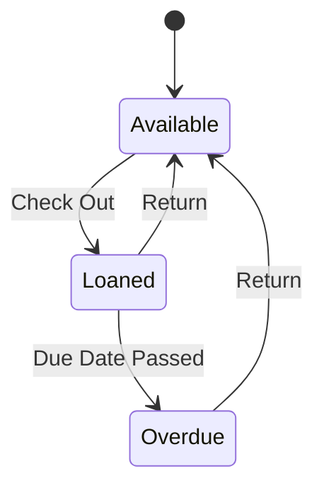

# Loan Tracking

## Overview

The Loan Tracking system helps users keep track of physical books lent out to friends and family. It ensures you never lose a book again by recording who has it and when it's due back.

## Features

- **Check Out**: Mark a book as loaned to a specific person.
- **Due Dates**: Set an expected return date.
- **Status Indicators**: Visual cues on book cards show if a book is currently loaned out.
- **History**: Keep a record of past loans for each book.
- **Notes**: Add specific notes about the loan (e.g., condition upon lending).

## Loan Lifecycle

## User Interface

### Loan Modal
Accessible from the book context menu, the Loan Modal allows users to:
1. Enter the **Borrower Name**.
2. Select a **Loan Date** (defaults to today).
3. Select a **Due Date** (optional).
4. Add **Notes**.

### Library View
- **Loaned Badge**: Books currently on loan display a "Loaned" badge on their card.
- **Filter**: Users can filter the library to see *only* loaned books.

## Data Model

The `loans` table tracks all loan events.

| Field | Type | Description |
|-------|------|-------------|
| `book_id` | FK | The book being loaned. |
| `borrower_name` | String | Name of the person borrowing the book. |
| `loan_date` | Date | When the book was given. |
| `due_date` | Date | When the book is expected back. |
| `return_date` | Date | When the book was actually returned (NULL if active). |

## Future Enhancements
- [ ] Email reminders for overdue books.
- [ ] Contact integration to pick borrowers from address book.
- [ ] "Request Return" notification system.
