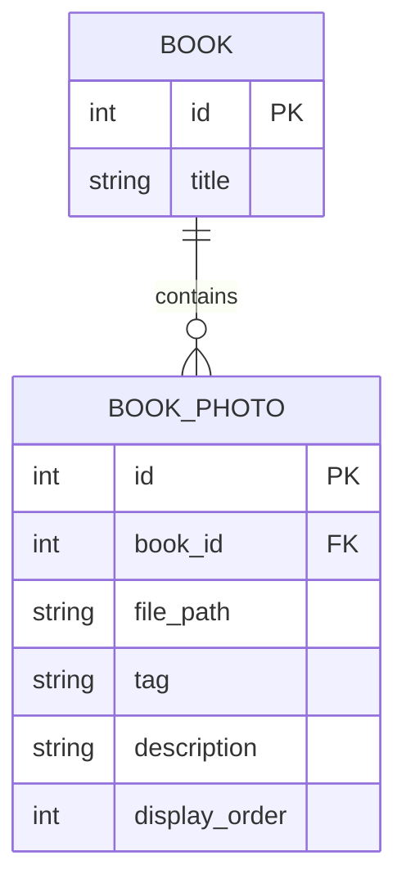

# Photo Gallery

## Overview

The Photo Gallery feature allows users to attach multiple custom images to a single book record. This is particularly useful for collectors who want to document specific details of their physical copies, such as binding, illustrations, or condition issues.

## Features

- **Multiple Photos**: Upload unlimited photos per book.
- **Tagging System**: Categorize photos for easy organization.
- **Lightbox View**: View high-resolution images in a full-screen overlay.
- **Lazy Loading**: Thumbnails load efficiently to maintain performance.

## Data Model

Photos are stored in the `book_photos` table and linked to the `books` table via `book_id`.

## Supported Tags

Users can select from the following tags when uploading:
- **Cover**: Front or back cover art.
- **Spine**: The book's spine.
- **Edges**: Sprayed or gilded edges.
- **Interior**: Illustrations, maps, or text layout.
- **Special**: Signatures, dedications, or unique features.

## User Interface

### Gallery Component
The `PhotoGallery` component displays a grid of thumbnails. Clicking a thumbnail opens the lightbox.

### Upload Flow
1. User clicks "Upload Photo".
2. Selects file from device.
3. Chooses a tag (optional).
4. Clicks "Upload".
5. Image is sent to server, saved to disk, and database record created.
6. Gallery refreshes to show new photo.

## Technical Implementation

- **Backend**: Uses `multer` for handling `multipart/form-data` uploads. Files are stored in the `server/uploads` directory.
- **Frontend**: Uses `PhotoService` to interact with the API.
- **Storage**: File paths are stored in the database relative to the uploads directory.

## Future Enhancements
- [ ] Drag-and-drop reordering of photos.
- [ ] Image cropping and rotation tools.
- [ ] Bulk upload support.
- [ ] Image compression on upload.
