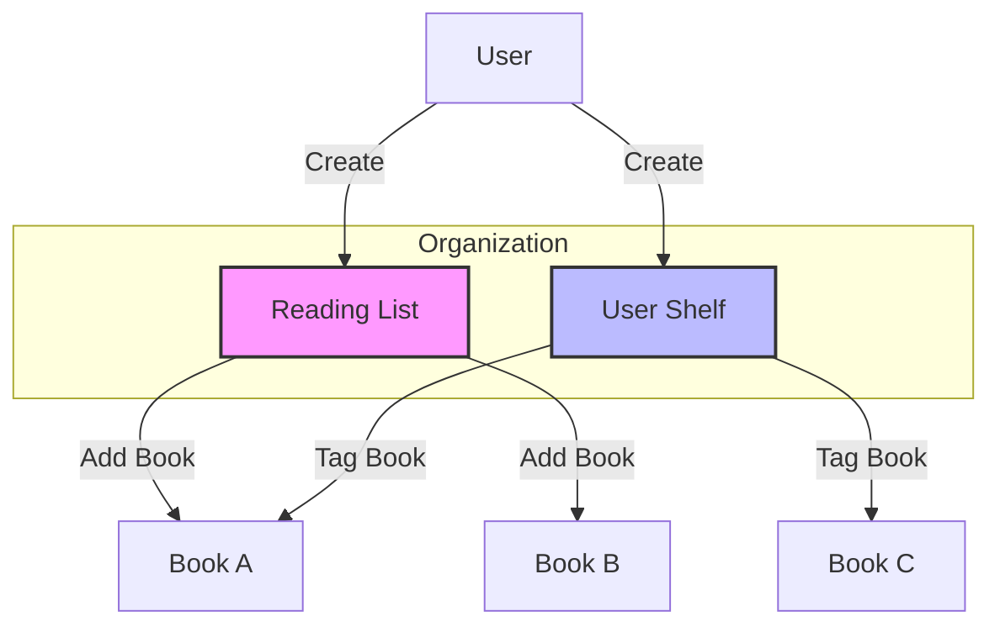

# Reading Lists & Shelves

## Overview

BookBoss provides two distinct ways to organize books beyond the standard library grid: **Reading Lists** and **User Shelves**. While similar, they serve different purposes in the user workflow.

## Comparison

| Feature | Best Used For | Examples |
|---------|---------------|----------|
| **Reading Lists** | Ordered collections, often temporary or goal-oriented. | "To Read 2024", "Summer Reading", "Book Club Picks" |
| **User Shelves** | Categorical organization, virtual grouping. | "Favorites", "Reference", "Cookbooks", "Signed Copies" |

## Reading Lists

Reading Lists are ordered sequences of books.

### Features
- **Custom Ordering**: Books can be arranged in a specific order (e.g., priority).
- **Public/Private**: Lists can be marked as public to share with others (future feature).
- **Progress Tracking**: See how many books in the list have been read.

### Data Structure
- `reading_lists`: Stores list metadata (name, description).
- `reading_list_books`: Junction table linking books to lists with a `position` field.

## User Shelves

Shelves act like virtual tags or folders. A book can belong to multiple shelves.

### Features
- **Color Coding**: Assign custom colors to shelves for visual distinction.
- **Quick Filtering**: Filter the main library view to show only books on a specific shelf.
- **Badges**: Shelf names can appear as badges on book cards.

### Data Structure
- `user_shelves`: Stores shelf metadata (name, color).
- `shelf_books`: Junction table linking books to shelves.

## Workflow

## Future Enhancements
- [ ] Drag-and-drop sorting for reading lists.
- [ ] "Smart Shelves" that auto-populate based on criteria (e.g., "5-star books").
- [ ] Sharing lists via URL.
- [ ] Bulk add to shelf/list.
