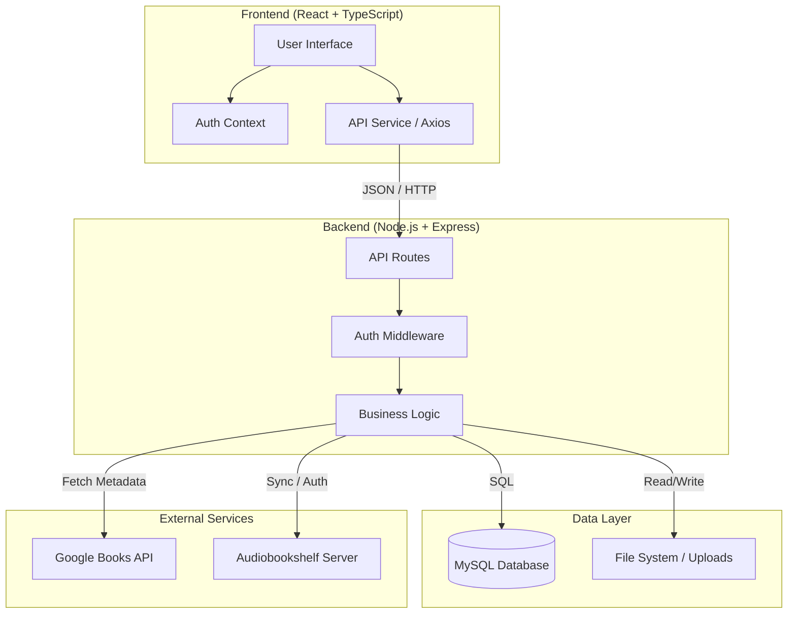

# System Architecture

This document outlines the high-level architecture of the BookBoss application following the migration to React.

## Overview

BookBoss uses a modern 3-tier architecture:
1.  **Client**: A Single Page Application (SPA) built with React and TypeScript.
2.  **Server**: A Node.js/Express REST API.
3.  **Database**: MySQL for structured data storage.

## Architecture Diagram

## Components

### Frontend (Client)
-   **Technology**: React 18, TypeScript, Vite.
-   **Responsibility**: Handles user interaction, state management (Auth, Theme), and rendering.
-   **Deployment**: Static assets served via Nginx or Node.js static middleware.

### Backend (Server)
-   **Technology**: Node.js, Express.
-   **Responsibility**:
    -   Provides RESTful API endpoints.
    -   Handles Authentication (JWT/Session Tokens).
    -   Manages business logic (Book CRUD, User management).
    -   Integrates with external APIs.
-   **Security**: Validates tokens, sanitizes inputs.

### Database
-   **Technology**: MySQL.
-   **Responsibility**: Stores persistent data including Users, Books, Loans, Shelves, and Settings.

### External Integrations
-   **Google Books API**: Used for fetching book metadata (cover, title, author, etc.) by ISBN.
-   **Audiobookshelf**: Optional integration to sync with self-hosted audiobook servers.
