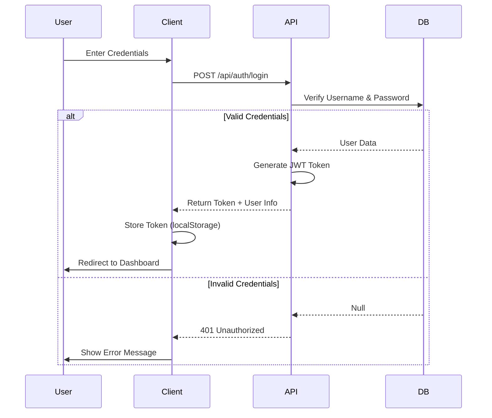

# User Authentication

## Overview

BookBoss uses a secure, token-based authentication system to manage user access and permissions. The system supports multiple user roles (Admin, Editor, Viewer) and protects API endpoints using JSON Web Tokens (JWT).

## Architecture



## Features

### 1. Registration & Login
- **Registration**: New users can sign up (if allowed by system settings) or be created by an Admin.
- **Login**: Users authenticate with username and password.
- **Session Persistence**: JWT tokens are stored locally to maintain session state across page reloads.

### 2. Role-Based Access Control (RBAC)
The system defines three primary roles:

| Role | Permissions |
|------|-------------|
| **Admin** | Full access to all features, including User Management and System Settings. |
| **Editor** | Can add, edit, and delete books, manage lists, and upload photos. Cannot manage other users. |
| **Viewer** | Read-only access to the library. Can view books and lists but cannot make changes. |

### 3. Protected Routes
On the frontend, the `ProtectedRoute` component checks for a valid authentication token before rendering sensitive pages.

```tsx
// Example Usage
<Route 
  path="/settings" 
  element={
    <ProtectedRoute>
      <SettingsPage />
    </ProtectedRoute>
  } 
/>
```

## Security Implementation

- **Passwords**: Hashed using `bcrypt` before storage in the database.
- **Tokens**: Signed using a secret key (`JWT_SECRET`) with an expiration time.
- **Headers**: All authenticated requests must include the `Authorization: Bearer <token>` header.

## User Management (Admin)

Admins have a dedicated interface in the Settings area to:
- View all registered users.
- Create new users manually.
- Update user roles.
- Delete users.
- Reset passwords (planned).

## Future Enhancements
- [ ] Password reset via email.
- [ ] OAuth integration (Google, GitHub).
- [ ] Two-factor authentication (2FA).
- [ ] User profile avatars.
