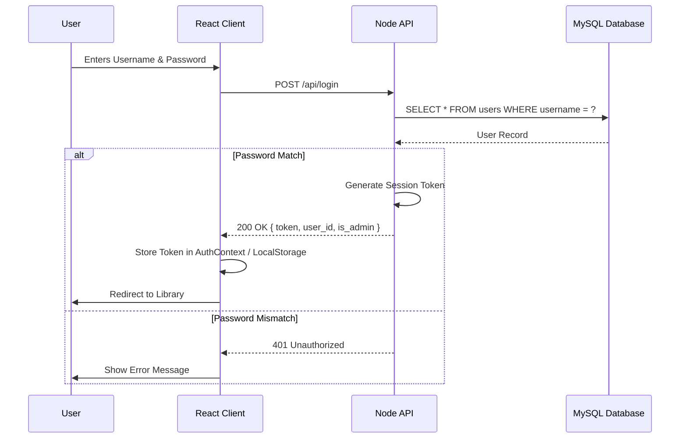
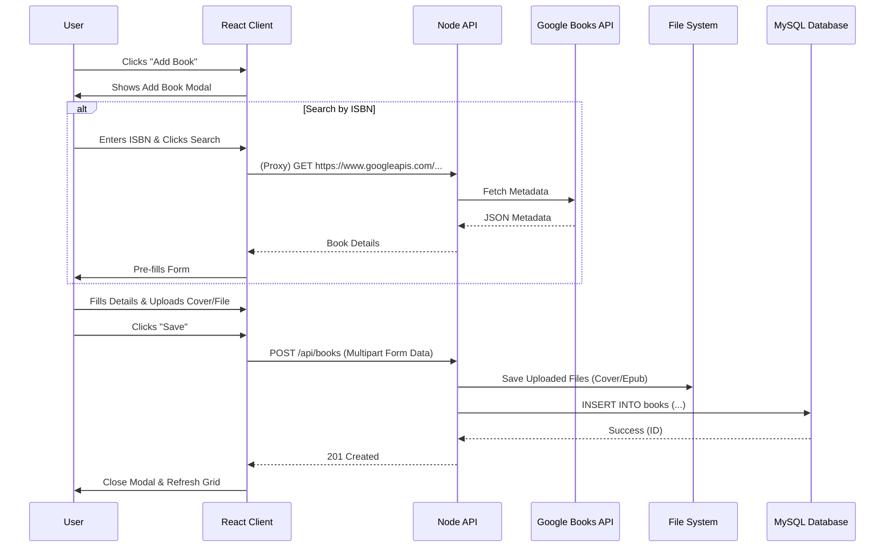
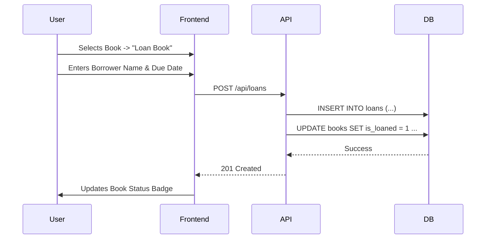

# User Flows

This document visualizes key user interactions within the BookBoss application.

## Authentication Flow

Process for logging in a user and establishing a session.

## Add Book Flow

Process for adding a new book, including metadata and optional file uploads.

## Loan Book Flow

Process for tracking a book lent to a friend.

